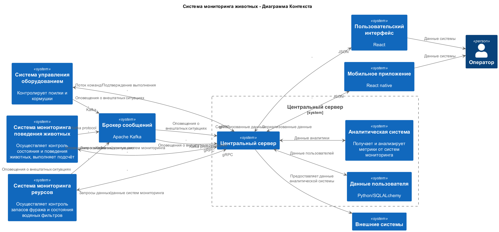
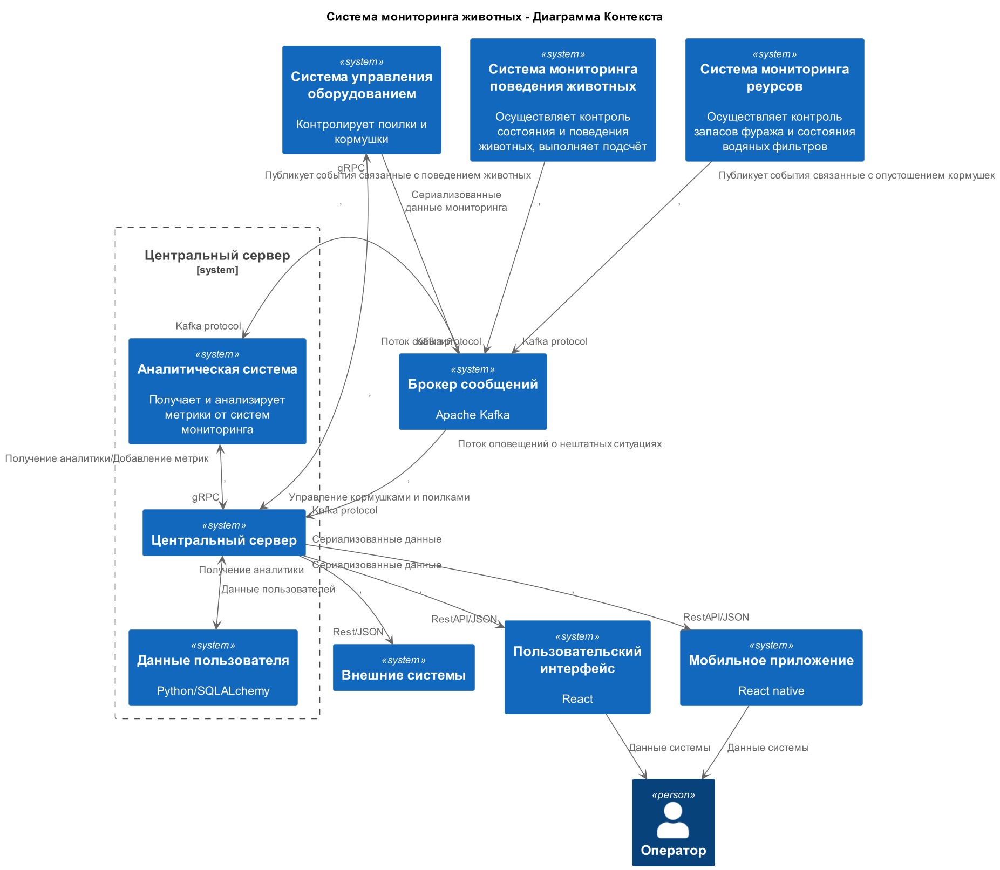

### **Название задачи: Создание MVP для мониторинга свиноводческих ферм** 
### **Автор: Команда разработки AgTech**
### **Дата: 2025.08.02**
### **Функциональные требования**
Опишите здесь верхнеуровневые Use Cases. Их нужно оформить в виде таблицы с пошаговым описанием.
| **№** | **Действующие лица или системы** | **Use Case**                                     | **Описание**                                                     |
|   1   | Оператор                         | Управление поилками                              | Оператор отправляет команды поилкам используя UI                 |
|   2   | Оператор                         | Управление кормушками                            | Оператор отправляет команды кормушкам используя UI               |
|   3   | Оператор                         | Добавление/удаление/получение метрик и данных    | Оператор управляет метриками и получает данные аналитики         |
|   4   |                                  | аналитики                                        | используя UI                                                     |
|   5   | Система мониторинга животных     | Мониторинг поведения животных                    | Система фиксирует признаки беспокойного поведения                |
|   5   |                                  |                                                  | или драк среди животных и центральный сервер                     |
|   6   | Система мониторинга животных     | Мониторинг задавливания поросят                  | Система фиксирует признаки задавливания поросят                  |
|   6   | Система мониторинга животных     |                                                  | и уведомляет центральный сервер                                  |
|   7   | Система мониторинга животных     | Пересчет поголовья                               | Система пересчитывает поголовье                                  |
|   8   | Система мониторинга животных     | Мониоринг состояния животных по внешнему виду    | Система оценивает состояние животных по внешнему виду            |
|   8   |                                  |                                                  | и отправляет уведомления центральному серверу в случае           |
|   8   |                                  |                                                  | неудовлетворительного состояния                                  |
|   9   | Система мониторинга ресурсов     | Мониторинг запаса еды                            | Система оценивает и отправляет уведомления                       |
|       |                                  |                                                  | уведомления центральному серверу в случае истощения              |
|       |                                  |                                                  | запасов                                                          |
|   10  | Система мониторинга ресурсов     | Мониторинг состояния водяных фильтров            | Система оценивает состояние фильтров и отправляет                |
|       |                                  |                                                  | отправляет уведомления центральному серверу                      |
|       |                                  |                                                  | в случае неполадок или неудовлетворительного состояния           |
|   11  | Центральный сервер               | Оповещение оператора в случае нештатной ситуации | Центральный сервер оповещает оператора о нештатных ситуациях в   |
|       |                                  |                                                  | системах агентах                                                 |
|   12  | Центральный сервер               | API для внешних систем                           | Центральный сервер предоставляет API для внешних систем          |
|   13  | Система(Kafka)                   | Публикация событий агентов, потребляемых         | Система получает события публикуемые системами агентами и        |
|       |                                  | центральным сервером и аналитической системой    | сохраяет их в случае обрыва соединения                           |
|   14  | Аналитическая система            | Генерация аналитики на основе базовых и          | Система генерирует аналитику на основе данных предоставленых     |
|       | (центаральный сервер)            | предоставленых метрик аналитической системой     | системами агентами и запрашиваемыми метриками                    |
|   15  | Аналитическая система            | Управление метриками и сгенерированной и         | Система хранит, добавляет и удаляет метрики, генерирует и        |
|       | (центаральный сервер)            | аналитикой                                       | передаёт аналитику центральному серверу                          |
|   16  | Внешние системы                  | Добавление/удаление/получение метрик и данных    | Внешние системы управляют метриками и получают данные аналитики  |
|   17  | Внешние системы                  | аналитики                                        | используя API внешних систем                                     |
### **Нефункциональные требования**

Опишите здесь нефункциональные требования и архитектурно значимые требования.
| **№** | **Требование**                                           |
|   1   | Отказоустойчивость 99,95%                                |
|   2   | Расширяемость системы                                    |
|   3   | Высокая производительность (оповещение за 5 секунд)      |
|   4   | Реакция видеоаналитики в реальном времени (миллисекунды) |
|   5   | Поддержка работы без интернета                           |

### **Решение**
Приведите диаграммы контекста и контейнеров в модели C4. Опишите там основные компоненты и интеграции всех элементов решения.

