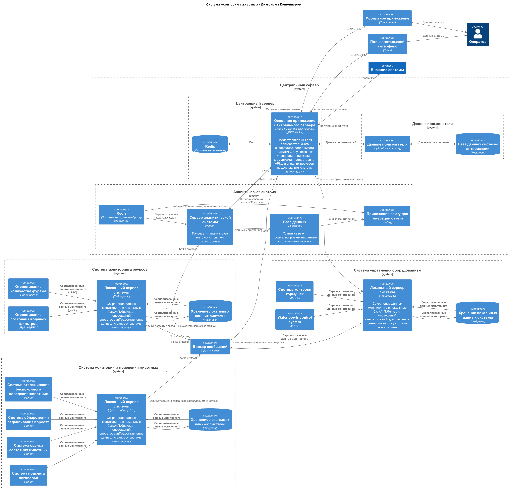

### **Название задачи: Создание MVP для мониторинга свиноводческих ферм** 
### **Автор: Команда разработки AgTech**
### **Дата: 2025.08.02**
### **Функциональные требования**
Опишите здесь верхнеуровневые Use Cases. Их нужно оформить в виде таблицы с пошаговым описанием.
| **№** | **Действующие лица или системы** | **Use Case**                                     | **Описание**                                                     |
|   1   | Оператор                         | Управление поилками                              | Оператор отправляет команды поилкам используя UI                 |
|   2   | Оператор                         | Управление кормушками                            | Оператор отправляет команды кормушкам используя UI               |
|   3   | Оператор                         | Добавление/удаление/получение метрик и данных    | Оператор управляет метриками и получает данные аналитики         |
|   4   |                                  | аналитики                                        | используя UI                                                     |
|   5   | Система мониторинга животных     | Мониторинг поведения животных                    | Система фиксирует признаки беспокойного поведения                |
|   5   |                                  |                                                  | или драк среди животных и центральный сервер                     |
|   6   | Система мониторинга животных     | Мониторинг задавливания поросят                  | Система фиксирует признаки задавливания поросят                  |
|   6   | Система мониторинга животных     |                                                  | и уведомляет центральный сервер                                  |
|   7   | Система мониторинга животных     | Пересчет поголовья                               | Система пересчитывает поголовье                                  |
|   8   | Система мониторинга животных     | Мониоринг состояния животных по внешнему виду    | Система оценивает состояние животных по внешнему виду            |
|   8   |                                  |                                                  | и отправляет уведомления центральному серверу в случае           |
|   8   |                                  |                                                  | неудовлетворительного состояния                                  |
|   9   | Система мониторинга ресурсов     | Мониторинг запаса еды                            | Система оценивает и отправляет уведомления                       |
|       |                                  |                                                  | уведомления центральному серверу в случае истощения              |
|       |                                  |                                                  | запасов                                                          |
|   10  | Система мониторинга ресурсов     | Мониторинг состояния водяных фильтров            | Система оценивает состояние фильтров и отправляет                |
|       |                                  |                                                  | отправляет уведомления центральному серверу                      |
|       |                                  |                                                  | в случае неполадок или неудовлетворительного состояния           |
|   11  | Центральный сервер (основное     | Оповещение оператора в случае нештатной ситуации | Центральный сервер оповещает оператора о нештатных ситуациях в   |
|       | приложение)                      |                                                  | системах агентах, получает данные из системы обмена сообщениями  |
|       |                                  |                                                  | (Kafka)                                                          |
|   12  | Центральный сервер (основное     | API для внешних систем                           | Центральный сервер предоставляет API для внешних систем          |
|   12  | приложение)                      |                                                  |                                                                  |
|   13  | Система обмена сообщениями(Kafka)| Публикация событий агентами, потребляемых        | Система получает события публикуемые системами агентами и        |
|       |                                  | центральным сервером и системой аналитики        | сохраяет их в случае обрыва соединения                           |
|   14  | Аналитическая система            | Генерация аналитики на основе базовых и          | Система генерирует аналитику на основе данных предоставленых     |
|       | (центаральный сервер)            | предоставленых метрик аналитической системой     | системами агентами и запрашиваемыми метриками                    |
|   15  | Аналитическая система            | Управление метриками и сгенерированной и         | Система хранит, добавляет и удаляет метрики, генерирует и        |
|       | (центаральный сервер)            | аналитикой                                       | передаёт аналитику центральному серверу                          |
|   16  | Аналитическая система            | Потребляет данные передаваемые системой обмена   | Система получает данные от системы обмена сообщения(Kafka)       |
|       | (центаральный сервер)            | сообщениями(Kafka)                               | сохраняет их в базу данных для последующей генерации аналитики   |
|   17  | Внешние системы                  | Добавление/удаление/получение метрик и данных    | Внешние системы управляют метриками и получают данные аналитики  |
|       |                                  | аналитики                                        | используя API внешних систем                                     |
|   18  | Система авторизации              | Сохраняет данные пользователей, осуществляет     | Система управляет данными пользователей и осуществляет авториза- |
|       |                                  | авторизацию по запросу основного приложения      | цию и аутентификацию, а так же возврат данных пользователя при   |
|       |                                  |                                                  | запросе от клиентских приложений и внешних систем к основному    |
|       |                                  |                                                  | приложению центрального сервера                                  |
### **Нефункциональные требования**

Опишите здесь нефункциональные требования и архитектурно значимые требования.
| **№** | **Требование**                                           |
|   1   | Отказоустойчивость 99,95%                                |
|   2   | Расширяемость системы                                    |
|   3   | Высокая производительность (оповещение за 5 секунд)      |
|   4   | Реакция видеоаналитики в реальном времени (миллисекунды) |
|   5   | Поддержка работы без интернета                           |

### **Решение**
Приведите диаграммы контекста и контейнеров в модели C4. Опишите там основные компоненты и интеграции всех элементов решения.

Также опишите, какой логикой вы руководствовались в ходе принятия решений и выбора технологий. Не забывайте, что необходимо учесть все функциональные и нефункциональные требования.
1. Использование микросервисной архитектуры для обеспечения гибкости и масштабируемости. Каждый новый агент - независимый микросервис. Работающий с сисетмой обмена сообщениями,
лобо предоставляющий API для работы с ним.
2. Использование системы обмена сообщениями для доставки данных от агентов к центральному серверу и аналитической системе. Каждый агент публикует сообщения в систему обмена сообщениями(Kafka) 
обеспечивающую доставку и хранение сообщений в случае сбоев. Аналитическая система получает данные из Kafka и сохраняет их в базу занных. Основное приложение центрального сервереа
так же получает сообщения из Kafka, но обрабатывает только те, что имеют статус "Оповещение".
3. Выбор технологий, знакомых команде разработчиков (Kafka уже используется в цифровой инфраструктуре компании, соответственно не потребует времени на освоение командой разработчиков).
4. Выбор технологий, обеспечивающих высокую скорость передачи и сериализацию данных(gRPC, protobuf) для управления системами котроля оборудования и запроса/передачи данных к/от аналитической
системы центральному серверу.
**Недостатки, ограничения, риски**
1. Дополнительная нагрузка на аналитическую систему: система постоянно получает сообщения от системы обмена сообщениями и сохраняет их в базу данных,
как следствие увеличивается нагрузка на базу данных, возрастает время отклика.
Решение: использование асинхронной системы выполнения задач(Celery) для проведения аналитики. Это позволит снизить нагрузку на аналитическую систему, но не решит проблему нагрузки на базу данных.
2. Потеря данных в случае обрыва соединения.
Так как данные не хранятся на серверах систем "агентов" при обрыве соединения возможна потеря или повреждение передаваемых данных.
3. Возросшая нагрузка на систему обмена сообщениями. Так как все данные мониторинга проходят через систему обмена сообщениями, нагрузка не неё возрастает и как следствие увеличивается
время, необходимое для оповещении оператора о внештатной ситуации.