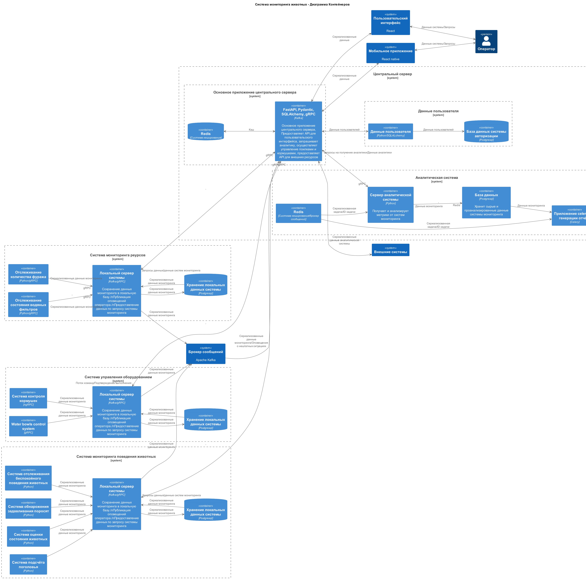

### **Название задачи: Создание MVP для мониторинга свиноводческих ферм** 
### **Автор: Команда разработки AgTech**
### **Дата: 2025.08.02**
### **Функциональные требования**
Опишите здесь верхнеуровневые Use Cases. Их нужно оформить в виде таблицы с пошаговым описанием.
| **№** | **Действующие лица или системы** | **Use Case**                                     | **Описание**                                                     |
|   1   | Оператор                         | Управление поилками                              | Оператор отправляет команды поилкам используя UI                 |
|   2   | Оператор                         | Управление кормушками                            | Оператор отправляет команды кормушкам используя UI               |
|   3   | Оператор                         | Добавление/удаление/получение метрик и данных    | Оператор управляет метриками и получает данные аналитики         |
|   4   |                                  | аналитики                                        | используя UI                                                     |
|   5   | Система мониторинга животных     | Мониторинг поведения животных                    | Система фиксирует признаки беспокойного поведения                |
|   5   |                                  |                                                  | или драк среди животных и центральный сервер                     |
|   6   | Система мониторинга животных     | Мониторинг задавливания поросят                  | Система фиксирует признаки задавливания поросят                  |
|   6   | Система мониторинга животных     |                                                  | и уведомляет центральный сервер                                  |
|   7   | Система мониторинга животных     | Пересчет поголовья                               | Система пересчитывает поголовье                                  |
|   8   | Система мониторинга животных     | Мониоринг состояния животных по внешнему виду    | Система оценивает состояние животных по внешнему виду            |
|   8   |                                  |                                                  | и отправляет уведомления центральному серверу в случае           |
|   8   |                                  |                                                  | неудовлетворительного состояния                                  |
|   9   | Система мониторинга ресурсов     | Мониторинг запаса еды                            | Система оценивает и отправляет уведомления                       |
|       |                                  |                                                  | уведомления центральному серверу в случае истощения              |
|       |                                  |                                                  | запасов                                                          |
|   10  | Система мониторинга ресурсов     | Мониторинг состояния водяных фильтров            | Система оценивает состояние фильтров и отправляет                |
|       |                                  |                                                  | отправляет уведомления центральному серверу                      |
|       |                                  |                                                  | в случае неполадок или неудовлетворительного состояния           |
|   11  | Центральный сервер (основное     | Оповещение оператора в случае нештатной ситуации | Центральный сервер оповещает оператора о нештатных ситуациях в   |
|       | приложение)                      |                                                  | системах агентах, получает данные из системы обмена сообщениями  |
|       |                                  |                                                  | (Kafka)                                                          |
|   12  | Центральный сервер (основное     | API для внешних систем                           | Центральный сервер предоставляет API для внешних систем          |
|   12  | приложение)                      |                                                  |                                                                  |
|   13  | Система обмена сообщениями(Kafka)| Публикация событий агентами, потребляемых        | Система получает события публикуемые системами агентами и        |
|       |                                  | центральным сервером                             | сохраяет их в случае обрыва соединения                           |
|   14  | Аналитическая система            | Генерация аналитики на основе базовых и          | Система генерирует аналитику на основе данных предоставленых     |
|       | (центаральный сервер)            | предоставленых метрик аналитической системой     | системами агентами и запрашиваемыми метриками                    |
|   15  | Аналитическая система            | Управление метриками и сгенерированной и         | Система хранит, добавляет и удаляет метрики, генерирует и        |
|       | (центаральный сервер)            | аналитикой                                       | передаёт аналитику центральному серверу                          |
|   16  | Аналитическая система            | Запрашивает данные у систем агентов используя    | Система запрашивает данные у систем агентов при запросе аналитики|
|       | (центаральный сервер)            | синхронные вызовы                                | оператором или внешними системами                                |
|   17  | Внешние системы                  | Добавление/удаление/получение метрик и данных    | Внешние системы управляют метриками и получают данные аналитики  |
|       |                                  | аналитики                                        | используя API внешних систем                                     |
|   18  | Система авторизации              | Сохраняет данные пользователей, осуществляет     | Система управляет данными пользователей и осуществляет авториза- |
|       |                                  | авторизацию по запросу основного приложения      | цию и аутентификацию, а так же возврат данных пользователя при   |
|       |                                  |                                                  | запросе от клиентских приложений и внешних систем к основному    |
|       |                                  |                                                  | приложению центрального сервера                                  |
### **Нефункциональные требования**

Опишите здесь нефункциональные требования и архитектурно значимые требования.
| **№** | **Требование**                                           |
|   1   | Отказоустойчивость 99,95%                                |
|   2   | Расширяемость системы                                    |
|   3   | Высокая производительность (оповещение за 5 секунд)      |
|   4   | Реакция видеоаналитики в реальном времени (миллисекунды) |
|   5   | Поддержка работы без интернета                           |

### **Решение**
Приведите диаграммы контекста и контейнеров в модели C4. Опишите там основные компоненты и интеграции всех элементов решения.

Также опишите, какой логикой вы руководствовались в ходе принятия решений и выбора технологий. Не забывайте, что необходимо учесть все функциональные и нефункциональные требования.

1. Использование микросервисной архитектуры для обеспечения гибкости и масштабируемости(каждый дополнительный агент является полноценным сервером 
с независимой базой данных, что обеспечивает отказоустйчивость и низкую связанность, а так же гарантирует сохранение данных мониторинга и защиту от потерь данных при обрыве соединения).
2. Выбор технологий, поддерживающих работу в условиях нестабильного WiFi (Kafka обладает собственной системой хранения сообщений, в следствие оповещения не будут потеряны в случае обрыва связи).
3. Выбор технологий, знакомых команде разработчиков (Kafka уже используется в цифровой инфраструктуре компании, соответственно не потребует времени на освоение командой разработчиков).
4. Выбор технологий, обеспечивающих высокую скорость передачи и сериализацию данных(gRPC, protobuf) для получения данных от агентов и обмена данными между основным приложением центрального
сервера системами аналитики и авторизации.
5. Сокращение нагрузки на центральный сервер и аналитическую систему. Данные сохраняются в базу данных агента.
   Передача данных происходит по запросу аналитической системы. Такой подход снижает нагрузку на систему обмена сообщениями(публикуются только важные оповещения,
   требующие внимания оператора, что сокращает нагрузку на основной сервер системы).
6. Интеграция готовых нейросетевых моделей для анализа поведения животных.
7. Обеспечение возможности работы системы в оффлайн-режиме (Каждый агент сохраняет данные в локальную базу и способен отправлять их в систему обмена сообщениями при восстановлении связи)
**Недостатки, ограничения, риски**
1. Дополнительные сложности при развёртывании. Каждому агенту необходима отдельная база данных, что требует поддержки дополнительной кодовой базы.
2. Дополнительные ресурсы. Каждый агент требует дополнительное место на сервере для хранения данных.
3. Множественные источники данных. При получении данных от агентов, аналитическая система запрашивает данные от каждого агента, что увеличивает время ожидания ответа.
Решение: использовать асинхронные системы для сбора аналитики, а клиенту возвращать ID задачи. При запросе статуса задачи - возвращать текущий статус исполнения. При выполнении задачи, возвращать
ссылку на аналитику.
4. Сбои при запросе аналитики. Так как аналитическая система использует синхронные вызовы для получения данных при сбоях на сервере одного из агентов или "падении" сети аналитическая система
может получать неполные данные или возвращать ошибку
Решение: использование логику повторных вызовов, в случае возникновения ошибок.

### **Резюме**
Основной вариант реализации системы мониторинга является более эффективным так как:
1) Обеспечивает более высокую скорость доставки оповещений о внештатных ситуациях оператору.
2) Уменьшает нагрузку на центральный сервер.
3) Обеспечивает бОльшую сохранность данных по сравнению с альтернативным вариантов за счёт хранения данных в базах агентов.
4) Уменшает объём хранимых центральным сервером данных и как следствие снижает нагрузку на базы центрального сервера.
5) Снижает нагрузку на систему обмена сообщениями, за счёт синхронных запросов к серверам агентам с использованием gRPC.